# Human Activity Recognition (HAR)
Human Activity Recognition (HAR) refers to the capability of machines to identify various activities performed by the users. The knowledge acquired from these systems/algorithms is integrated into many applications where the associated device uses it to identify actions or gestures and performs predefined tasks in response.

## Dataset
For this assignent we will be using a publically available dataset called [UCI-HAR](https://ieeexplore.ieee.org/stamp/stamp.jsp?tp=&arnumber=8567275). The dataset is available to download [here](https://archive.ics.uci.edu/dataset/240/human+activity+recognition+using+smartphones). The Dataset contains data for 30 participants . Each participant performed six activities while wearing a Samsung Galaxy S II smartphone on their waist (The video of the participants taking data is also available [here](http://www.youtube.com/watch?v=XOEN9W05_4A)). The smartphone's accelerometer and gyroscope captured 3-axial linear acceleration and 3-axial angular velocity. Read all the `readme` and `info` files for more information.

## Task 1 : Exploratory Data Analysis (EDA) [3 marks]

### Preprocessing
We will use the raw accelerometer data within the inertial_signals folder. The provided script, `CombineScript.py`, organizes and sorts accelerometer data, establishing separate classes for each category and compiling participant data into these classes. `MakeDataset.py` script is used to read through all the participant data and create a single dataset. The dataset is then split into train,test and validation set. We focus on the first 10 seconds of activity, translating to the initial 500 data samples due to a sampling rate of 50Hz.

* **Step-1>** Place the `CombineScript.py` and `MakeDataset.py` in the same folder that contains the UCI dataset. Ensure you have moved into the folder before running the scripts. If you are runing the scripts from a different folder, you will have to play around with the paths in the scripts to make it work.
* **Step-2>** Run `CombineScript.py` and provide the paths to test and train folders in UCI dataset. This will create a folder called `Combined` which will contain all the data from all the participants. This is how most of the datasets are organized. You may encounter similar dataset structures in the future.
* **Step-3>** Run `MakeDataset.py` and provide the path to `Combined` folder. This will create a Dataset which will contain the train, test and validation set. You can use this dataset to train your models.

## Key Aspects for designing the model
The model is built upon the following key aspects and observations in the dataset:
1. Plot the waveform for data from each activity class. Are you able to see any difference/similarities between the activities?  Do you think the model will be able to classify the activities based on the data?

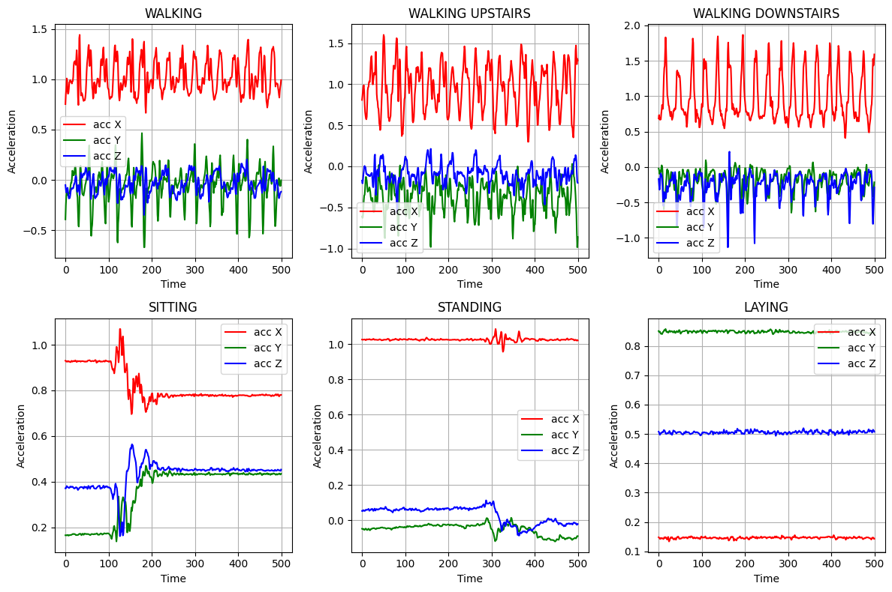

From the above plots, we can easily differentiate between the static activities (like laying, standing, and sitting) and dynamic activities (like walking, walking upstairs, and walking downstairs). This is because in dynamic activities, the variance seen is greater. Also, among activities belonging to the same class there are alot of similarities in the trends of the time series data. The model might be able to classify the activities as per their classes but further classification may require some advanced techniques (like hyperparameters tuning, etc.).

2. Do you think we need a machine learning model to differentiate between static activities (laying, sitting, standing) and dynamic activities(walking, walking_downstairs, walking_upstairs)? Look at the linear acceleration $(acc_x^2+acc_y^2+acc_z^2)$ for each activity and justify your answer. 

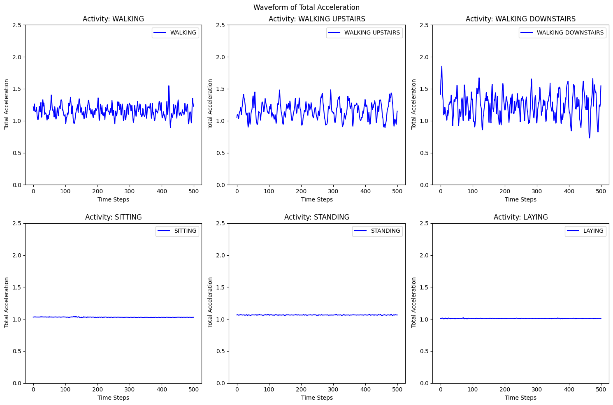

We can clearly see the difference between static and dynamic activities. Dynamic activities show large and frequent changes in total or linear acceleration over time, while static activities have almost constant acceleration with very little variation.

These clear differences make it easier for a model to separate static activities from dynamic ones. However, it can still be difficult for the model to tell apart activities within the same group—for example, distinguishing one dynamic activity from another, or one static activity from another—since their acceleration patterns look more similar.

### Use PCA to compress the acceleration timeseries
We use PCA [(Principal Component Analysis)](https://en.wikipedia.org/wiki/Principal_component_analysis) on Total Acceleration $(acc_x^2+acc_y^2+acc_z^2)$ and a flattened dataset into two features. We can visualize different classes of activities using the scatter plot below.
 

 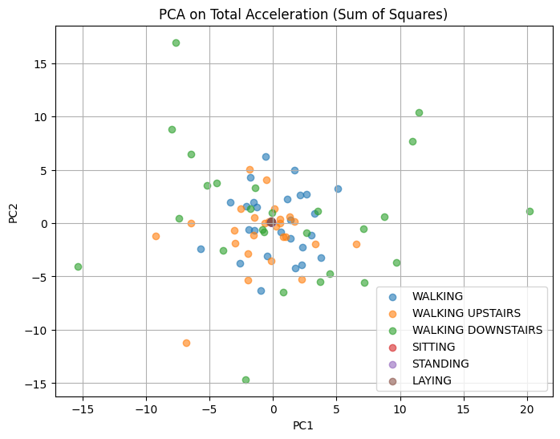
 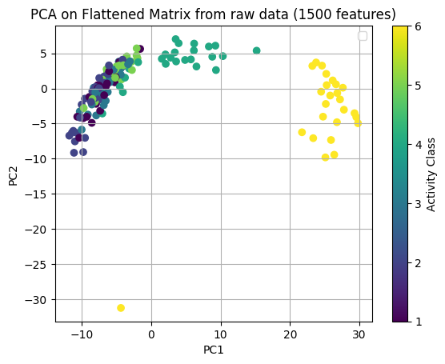
 

  

 > `NOTE`:The 1500-feature flattened matrix is derived from transforming a 3D time-series dataset of size 30x500x3 into a 2D matrix of size 30x1500. This transformation involves flattening the 500 timestamps of each of the 30 observations across the 3 directions (X, Y, and Z) into 1500 separate features.

### Use TSFEL library for feature extraction
We use [TSFEL](https://tsfel.readthedocs.io/en/latest/) ([a featurizer library](https://github.com/fraunhoferportugal/tsfel)) to create features (your choice which ones you feel are useful) and then perform PCA to obtain two features. We can visualize different class of activities using below scatter plot.

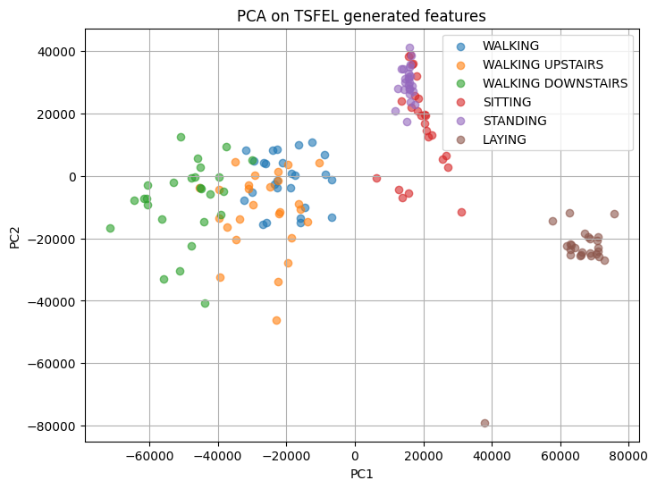

### Use the features provided by the dataset and perform PCA

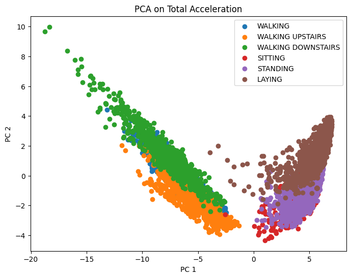

### Key observations
Comparing the Results obtained from PCA on total acceleration, TSFEL, and the dataset features, we can see that the results obtained from TSFEL are the most distinguishable. The results obtained from the dataset features are also distinguishable, but not as much as TSFEL. The results obtained from the total acceleration are not distinguishable at all. This is because the total acceleration is a sum of squares of the individual accelerations and does not capture the individual variations in the accelerations. Therefore, TSFEL is the best method.

### Calculate the correlation matrix of the features obtained by TSFEL and provided in the dataset. Identify the features that are highly correlated with each other. Are there any redundant features?

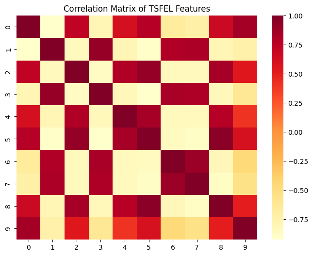

The 
Most Significant features are 4.
Pairwise features (2, 3), (4, 5), (6, 7) are quite correlated with each other.
Features 8 and 9 are highly correlated with each other, which may lead us to conclude that they are redundant.

The dataset shows only a few strongly correlated features. Some pairs are highly related and may be redundant, but most features remain fairly independent. This suggests that most features can contribute useful and distinct information to the model’s learning.

## Task 2 : Decision Trees for Human Activity Recognition [3 marks]

### Questions

### Use Sklearn Library to train Decision Tress.
1. Train a decision tree model using the raw accelerometer data. Report the accuracy, precision, recall and confusion matrix of the model.

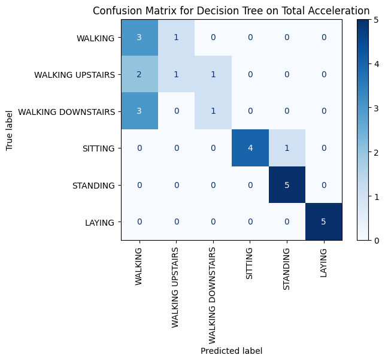

Accuracy: 0.704
Precision: 0.728
Recall: 0.704 

2. Train a decision tree model using the features obtained by TSFEL. Report the accuracy, precision, recall and confusion matrix of the model.

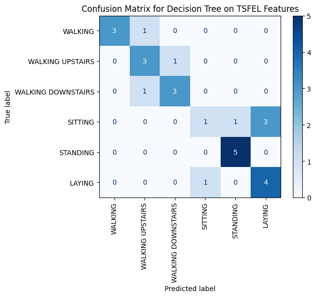

Accuracy: 0.704
Precision: 0.701
Recall: 0.704

3. Train a decision tree model using the features provided in the dataset. Report the accuracy, precision, recall and confusion matrix of the model.

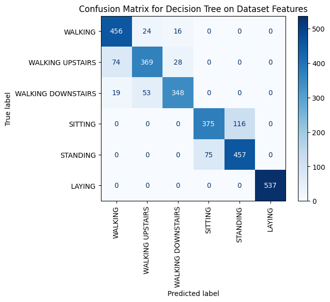

Accuracy: 0.863
Precision: 0.864
Recall: 0.863

4. Compare the results of the three models. Which model do you think is better?
The model performed best on the dataset features, as seen by the accuracy, precision, recall, and confusion matrix of the model. However, it is important to note that the dataset considered while training the model, which was actually trained on the dataset features, was significantly higher, which naturally gives it more learning than the rest of the datasets.
Moreover, using TSFEL on this much data is not optimal, but still, if only looking at the scatter plots, we can say that TSFEL does give better results, thus it may give better results on a bigger dataset.

      
2. Train Decision Tree with varying depths (2-8) using all above 3 methods. Plot the accuracy of the model on test data vs the depth of the tree. **[1 marks]**
For Total Acceleration:

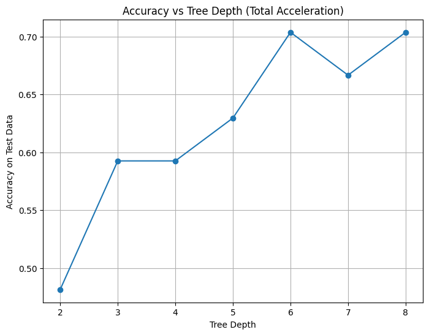

For TSFEL Features:

For Dataset Features:

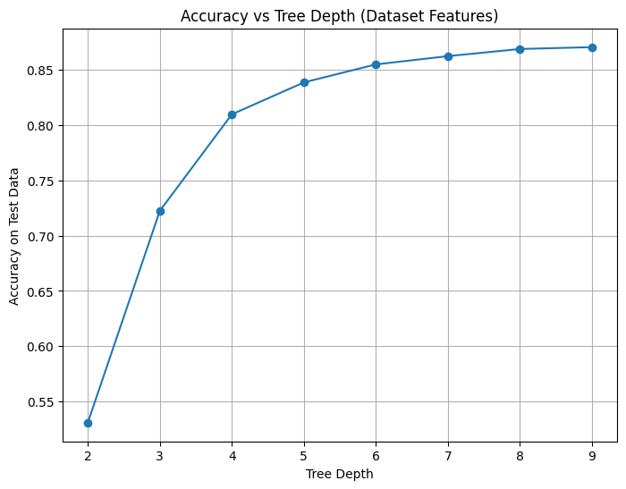

4. Are there any participants/ activitivies where the Model performace is bad? If Yes, Why? **[0.5 mark]**
The model shows poor performance in distinguishing between walking, walking downstairs, and walking upstairs. This difficulty arises because these activities generate highly similar motion patterns, which is also evident from the scatter plots.

Another contributing factor is the relatively small size of the training dataset, which limits the model’s ability to capture subtle differences between these classes. This is supported by the fact that the model trained on the provided dataset features achieved much higher accuracy—likely because the dataset was significantly larger, allowing for better learning despite the scatter plots suggesting otherwise.

Interestingly, the smaller size of the raw accelerometer dataset may also explain the absence of overfitting in that case, as the noise remains too irregular to dominate the learning process. In contrast, when training on the larger dataset features, signs of overfitting become apparent, indicating that it influences model optimization.

## Task 3 : Data Collection in the Wild [2 marks]

Utilized apps like `Physics Toolbox Suite` from your smartphone to collect your data in .csv/.txt format. Ensure at least 15 seconds of data is collected, trimming edges to obtain 10 seconds of relevant data. Collect 3-5 samples per activity class and report accuracy using both featurized and raw data. You have to train on the UCI dataset (You can use the entire dataset if you want) and test it on the data that you have collected, and report the accuracy and confusion matrix. Test your model's performance on the collected data, explaining why it succeeded or failed. 

### **Things to take care of:**
* Ensure the phone is placed in the same position for all the activities.
* Ensure the phone is in the same alignment during the activity, as changing the alignment will change the data collected and will affect the model's performance. 
* Ensure to have at least 10s of data per file for training. As the data is collected at 50Hz, you will have 500 data samples.

> `Collected Data folder` contains all the CSVs of data collected using the `Physics Toolbox Suite` app. Use the `downsample.py` file to downsample the data to get a 50 Hz of desired frequency.
### Collected Data signal

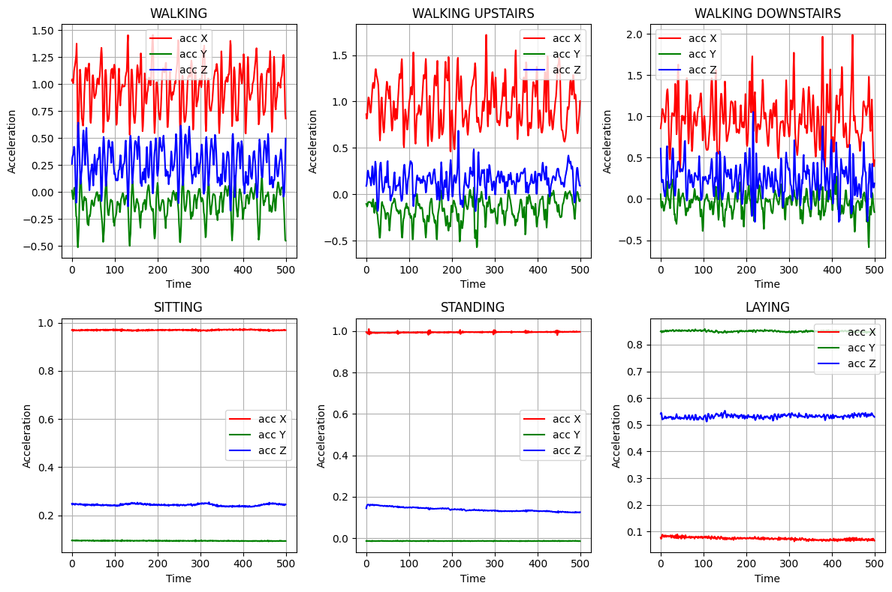

### Using the Decision Tree model trained on the UCI-HAR dataset to predict the activities that you performed. (Raw data, TSFEL Features, Features provided by the Dataset)

1. Predicting on the basis of Raw Data:

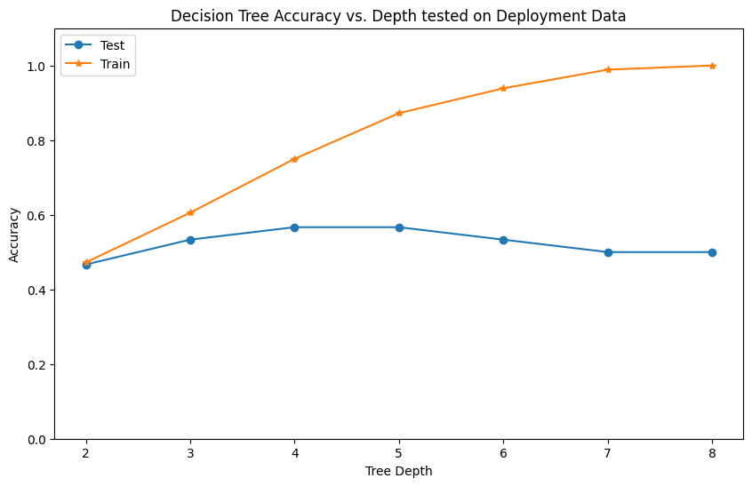

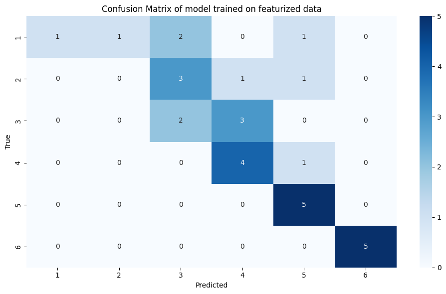

The accuracy varies from 46% to 53% (similar to recall, since the method for average used is weighted)
The precision is 86.5%
2. Predicting on the basis of 2D acceleration (Flattened data)

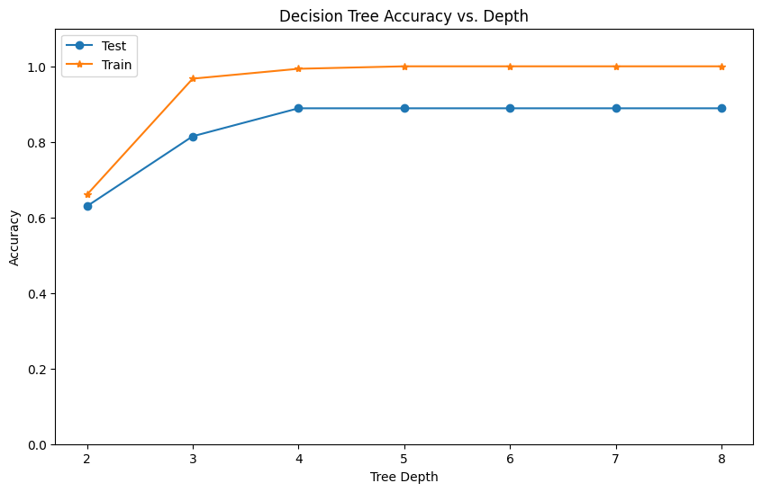

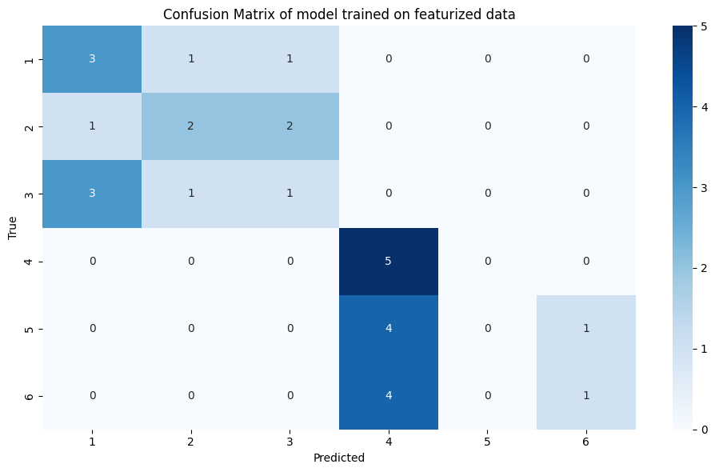

The accuracy ranges from 33.3% to 46% (similar to recall)
The precision varies from 17.2% to 41.4%

3. Predicting on the basis of TSFEL Features:

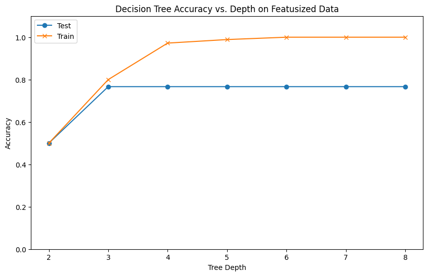

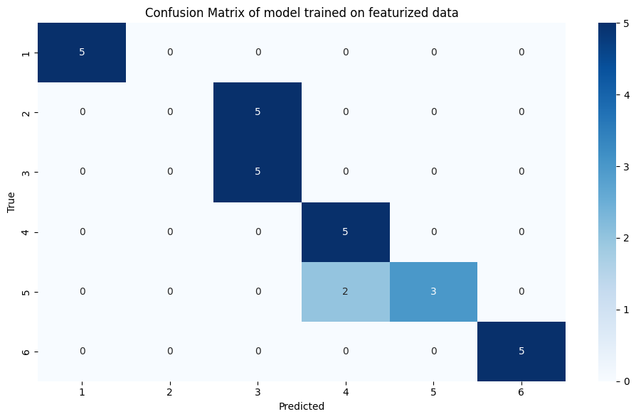

The accuracy and recall vary from 50% to 76%
The precision varies from 30% to 70%

### Results

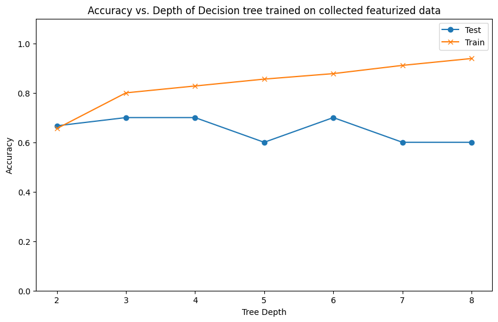

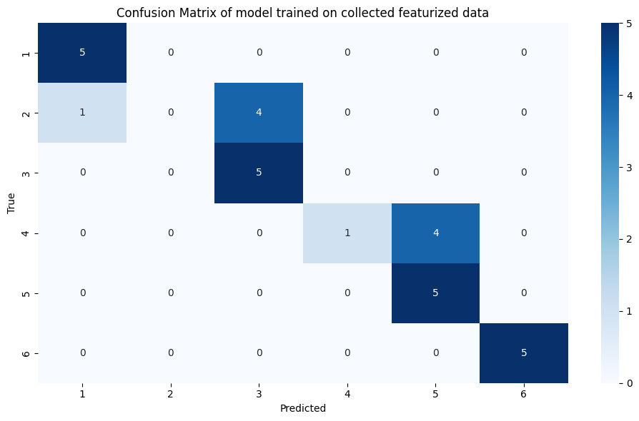

# **General Instructions :**
1. Show your results in a Jupyter Notebook or an MD file. If you opt for using an MD file, you should also include the code.
2. You can use the scikit-learn implementation of the Decision Tree for Human Activity Recognition.
